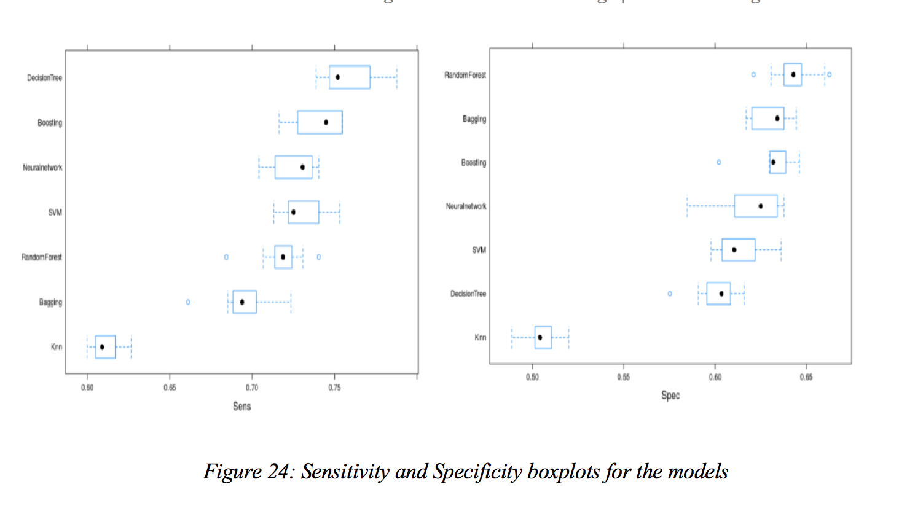

# Table of Contents
1. [Problem](README.md#problem)
1. [Input Dataset](README.md#input-dataset)
1. [Output](README.md#output)
1. [Approach](README.md#Approach)
1. [Testing](README.md#Testing)
1. [Logging](README.md#Logging)
1. [Run_Instructions](README.md#Run_Instructions)
1. [Questions?](README.md#questions?).


## Problem
In this problem we are given a list of users along with their demographics, web session records, and some summary statistics.
The problem here is to predict if a new user is likely to make reservation or not on the Airbnb platform.

## Goals


● To develop a predictive model that can predict whether a new user will make a booking or not, based on age, gender,
  demographics and session data.
   
● Identify factors which would increase the possibility of users making the reservation.

● To successfully achieve 80% accuracy from our predictive models.


## Input Data
The data is provided by the Airbnb and hosted by kaggle. Data contains information about given a list of users along 
with their demographics, web session records, and some summary statistics. 

The dataset contains two csv files train-users and  sessions.
 
●	train_users.csv (213k x 16) contains training set of users

●	sessions.csv (10.6m x 6) contains the information related to web session login for the user

These two data sets had to be joined on the common field UserID. This study employed a binary variable, 
Country Destination (DF = 1, NDF= 0), as the response variable. 

https://www.kaggle.com/c/airbnb-recruiting-new-user-bookings/data

## Hypothesis
We figured out that this is a binary class classification problem where our response variable is country destination and 
reference class is DF (Destination Found).

**Null Hypothesis** 
There exists no relationship between a users country destination and users demographics along with past browsing history.

**Alternate Hypothesis**
There exists a relationship between a users country destination and user’s demographic along with past browsing history.


## Exploratory data analysis

## Age

**Distribution**

Figure 3, graphically demonstrates the age distribution of users . It is evident from the graphs that maximum users lie 
in age group of 28 –34. Users in this age group are more likely to make reservation.


**Outliers**

 Figure 4, is the bar plot that shows us the outliers in the age. There are outliers which contains the false age of 
 2000 years. This is most probably a mistake made by users during registration.It is possible that some users entered
  their birth year instead of their age
  
 
 

## Gender 
Figure 5, is the gender-age box blot which shows the outliers. We can see that there exists unknown field in gender. 
Some users did not reveal their gender which were categorized as unknown.


## Signup method
Figure 6, is the bar plot of various signup methods used by the user. It is evident that most of the users prefer
using direct or facebook as their sign up method.


## Affiliate channel
Affiliate channel is the type of paid marketing used. Figure 7, shows that the most preferred affiliate 
channel used is direct.


## Language Distribution
It can be seen from figure 8, that English is the international language preference of the majority of Airbnb users.


## Distribution of Response Variable
It is important to check if the dataset is balanced before we try to fit any models on our data. Failing to do so may
 result in biased output. Figure 9, is the bar plot of the country destination which is our response variable. We can
 see in the figure below that the dataset is highly imbalanced.
 


## Data Cleaning
This stage involves cleaning and pre processing the the raw data based on the insights we gained from the exploratory 
analysis. 

### Balancing Dataset 
As it can be seen from the exploratory data analysis of the raw dataset, the response variable (Country destination) is 
highly imbalanced before we considered this problem as a binary class classification. The target variable country 
destination has 12 classes.  It is observed that out of 12 classes the class NDF is about 58% whereas Australia is about
 2% . Hence we try to balance the dataset by grouping all the countries as DF implying Destination found. We use 
 replace() function for this. Now we can see from Figure 10, the two classes NDF (58%) and DF (42%) are nearly balanced.


### Incomplete Rows with Blank Values, Unknown Values  and Imputation
A missing value in a data set means null or Not Applicable (NA). If that is the case, it should be explicitly imputed 
with that value, because it is not unknown, but was coded as empty. We used df.info() which is a user-defined function 
to detect rows in a dataframe that contained missing values, and used na.omit() to remove incomplete records. There were
variables that had unknown which we omitted. Seconds Elapsed field in the sessions dataset had missing data which we 
imputed with the average seconds elapsed. 

### Interpretation of Outliers
We used boxplot to see if there were any outliers  in each of the variables. It was observed that age field had outliers.
 We eliminated the rows that had age as 2000. Some users entered their birth year in the age field. We subtracted the 
 age entered by the user from the year 2014 to get the users age and used replace() function in R to replace such 
 incorrect data. We assumed that the minimum age has to be 18 as Airbnb does not allow users under 18 to make a booking.
  We omitted all the rows that had age below 18 or greater than 110.
  
### Identifying Near Zero Variables
The function nearZeroVar in Caret is used to diagnose the predictors that are constant with zero variance. It was 
observed that date_first_booking and language had near zero variance. Near-zero variance means that the fraction of 
unique values over the sample size is low. It is advantageous to remove these variables from the model. So, we remove 
these two variables. 

### Feature Engineering
Each user_id had multiple rows in the sessions dataset. This is because each user makes various activity flows. We then 
rearranged the dataset to show each user’s total number of unique actions, unique action types, unique action details, 
the most frequent action detail, most frequently used device, and total time spent on web as knowing every sequence and 
detail of web activities was not insightful. We used group by and summarize functions from the data wrangling techniques
 to implement this. This reduced the dimensionality of the sessions dataset as the total number of records reduced from
  10 million to 100k.
  
 ### Merging the datasets
 After carrying out initial data preprocessing individually on the two datasets, users and sessions, we merged them on 
 the column user_Id. The sessions dataset had data from 2014 while the users dataset from 2010. So we neglected all the 
 data between 2010 and 2014 in the users data set. Dimensions after merging the two datasets: 34342x 19

### Dummy Variables and Predictor Transformation
There are several categorical variables with two or more levels in predictors, such as gender, signup_method, action_type. 
Therefore, additional steps are needed to ensure that the results are interpretable. In our cleaned dataset we had 11 
out of 19 categorical predictors. We re-coded the categorical variables into a number of discrete variables using 
dummyVars() function.

## Model Planning
As the dependent variable has two different classes, it is a binary classification problem. The response variable which
is country_destination has values as “DF” meaning destination found and “NDF” as no destination found. Here, booking 
which is represented as “DF” will be considered as a positive class, on the other hand, no booking which is represented 
as  “NDF” will be considered as negative class. As, our dataset has balanced class with  52% data for class “DF” and 48% 
for class “NDF”, we did not have to perform any sampling techniques such as SMOTE (Synthetic Minority Oversampling Technique) 
and ROSE (Random Oversampling Examples) for handling class imbalance. As we were not sure of the shape of the relationship
 between various predictors and response variable, we decided to start with implementing simple linear models and then moving 
 gradually towards non-linear models and some advanced models such as SVM, Neural network. In addition to this, our dataset 
 had 11 categorical predictors out of 18 predictors hence we planned to do dummy coding for factor variables and decided 
 to implement models which work well with categorical data. 
 
 
## Model building
We used 10-fold cross validation to avoid overfitting of the model to the training dataset and identified the  performance
of a machine learning model on unseen data. Along with this we splitted the input dataset into 70:30 ratio resulting 
in 70% train data and 30% test data.Before fitting the model with the training dataset we tried to remove predictors 
from the dataset which will not be helpful in predicting the response variable. We used function from Caret package 
such as nearZeroVariance to identify variables which are having no variance and not contributing in identifying class.
 In our dataset we found some of them having near zero variance and hence were removed from dataset before fitting the 
 model. In order to provide informative predictors to the model which will help model accurately predict whether a person
  will book or not using Airbnb, it is important to know the significant variables. For this, we used VarImp function 
  to identify the predictors that we believe to be best related to the response. Here is an output of the results. 


We started implementing linear models such as Logistic Regression, LDA and QDA and then moved to implementing 
Non-linear models such as Naive Bayes, KNN, decision tree with bagging and boosting, random forest, Support Vector 
Machine and Neural network. We used the output of models to identify the important predictor variables.


## Results and Performance 
After running all the models, we saw that non-linear models performed better than linear models. Also, linear models 
were not able to fit the dataset well. On comparing all the models on performance metrics such as Accuracy, Precision, 
Recall, ROC and AUC, we identified that Gradient Boosting has outperformed all other models by providing accuracy score
 of 69% and a balanced precision and recall on both cross validated training set and test set. 


## Conclusion
The primary goal is to come up with the models for predicting whether a user will make a reservation or not using Airbnb 
and all the models that satisfied this criterion are discussed in above section. After running linear and non-linear 
models and comparing their performance based on ROC , AUC and boxplot, we identified Gradient Boosting model to be the 
best model that has given balanced precision- recall value and accuracy for both training and test data. AUC value for
 Boosting model is 0.75.
 
 
 
 
 
  
  

## Recommendations
We faced a lot of challenges during this project, and each challenge helped us get a better idea of the problem and 
how to deal with it. A key takeaway from working with real data, is understanding how the variables react with each 
other and how this can be used to model and create more complex variables using these interactions.
1.	To improve our model, we need additional data that would be potentially impactful in determining whether a user 
    will make booking or not.
2.	Hadoop Distributed File Systems and advanced modelling techniques can be leveraged for training model on this 
    large dataset to enhance the prediction.
3.	This model can be further explored as a multi-class problem to predict which country the user forecast demand.
4.	Airbnb can use this model to maximize their marketing effort by aiming at people of age group 27-34 to provide 
    enticing yet affordable offers to increase the rate of conversion from browsing to booking.is going to make his 
    first booking.


## References

````
●	An Introduction to Statistical Learning with Applications in R, 1st edition, 2015, Springer-Verlag, New York, 
    ISBN: 978-1-4614-7138-7 (ISL), Available for download at author’s website: http://www-bcf.usc.edu/~gareth/ISL/
●	Data Mining and Business Analytics with R, 1st edition, Wiley, ISBN-13: 978-1-118-44714-7 (DM) 
    Ebook available via SDSU library: http://library.calstate.edu/sandiego/books/record?id=b4880697
●	Data science & Big Data Analytics, Wiley. Retrieved from:
    http://www.csis.pace.edu/~ctappert/cs816-15fall/books/2015DataScience&BigDataAnalytics.pdf
●	The Caret Package. Retrieved from:
    http://topepo.github.io/caret/index.html
●	Airbnb New User Bookings. Retrieved from
    https://www.kaggle.com/c/airbnb-recruiting-new-user-bookings/data?

